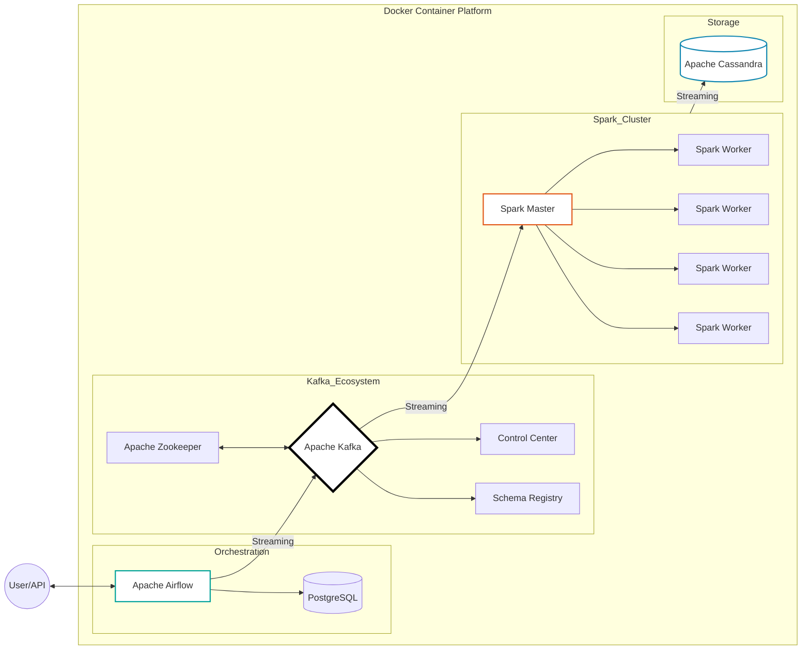

```mermaid
graph LR
    %% External Interface
    User((User/API)) <--> Airflow

    subgraph Docker_Infrastructure [Docker Container Platform]
        direction LR
        
        subgraph Orchestration
            Airflow[Apache Airflow]
            Postgres[(PostgreSQL)]
            Airflow --> Postgres
        end

        subgraph Kafka_Ecosystem
            Kafka{Apache Kafka}
            Zookeeper[Apache Zookeeper]
            Control[Control Center]
            Schema[Schema Registry]
            
            Zookeeper <--> Kafka
            Kafka --> Control
            Kafka --> Schema
        end

        subgraph Spark_Cluster
            SparkMaster[Spark Master]
            Worker1[Spark Worker]
            Worker2[Spark Worker]
            Worker3[Spark Worker]
            Worker4[Spark Worker]

            SparkMaster --> Worker1
            SparkMaster --> Worker2
            SparkMaster --> Worker3
            SparkMaster --> Worker4
        end

        subgraph Storage
            Cassandra[(Apache Cassandra)]
        end
    end

    %% Data Flow Connections
    Airflow -- "Streaming" --> Kafka
    Kafka -- "Streaming" --> SparkMaster
    Spark_Cluster -- "Streaming" --> Cassandra

    %% Styling
    style Kafka fill:#fff,stroke:#000,stroke-width:4px
    style Airflow fill:#fff,stroke:#01a299,stroke-width:2px
    style SparkMaster fill:#fff,stroke:#e25a1c,stroke-width:2px
    style Cassandra fill:#fff,stroke:#1287b1,stroke-width:2px
```
