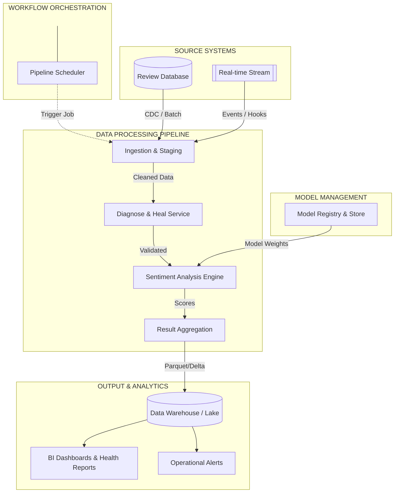

```mermaid
graph TD
    %% Workflow & Monitoring Section
    subgraph WM ["WORKFLOW ORCHESTRATION"]
        direction TB
        spacer1[ ] --- PS["Pipeline Scheduler"]
    end

    %% Source Systems Section
    subgraph SS ["SOURCE SYSTEMS"]
        RD[("Review Database")]
        RS[["Real-time Stream"]]
    end

    %% Data Processing Pipeline Section
    subgraph DP ["DATA PROCESSING PIPELINE"]
        direction LR
        IS["Ingestion & Staging"]
        DH["Diagnose & Heal Service"]
        SA["Sentiment Analysis Engine"]
        RA["Result Aggregation"]
        
        IS -- "Cleaned Data" --> DH 
        DH -- "Validated" --> SA 
        SA -- "Scores" --> RA
    end

    %% Model Management Section
    subgraph MM ["MODEL MANAGEMENT"]
        MR["Model Registry & Store"]
    end

    %% Output & Analytics Section
    subgraph OA ["OUTPUT & ANALYTICS"]
        direction RL
        DW[("Data Warehouse / Lake")]
        BI["BI Dashboards & Health Reports"]
        AL["Operational Alerts"]
        
        DW --> BI
        DW --> AL
    end

    %% Global Connections with Labels
    PS -. "Trigger Job" .-> IS
    RD -- "CDC / Batch" --> IS
    RS -- "Events / Hooks" --> IS
    MR -- "Model Weights" --> SA
    RA -- "Parquet/Delta" --> DW

    %% Styling
    style spacer1 fill:none,stroke:none
```
