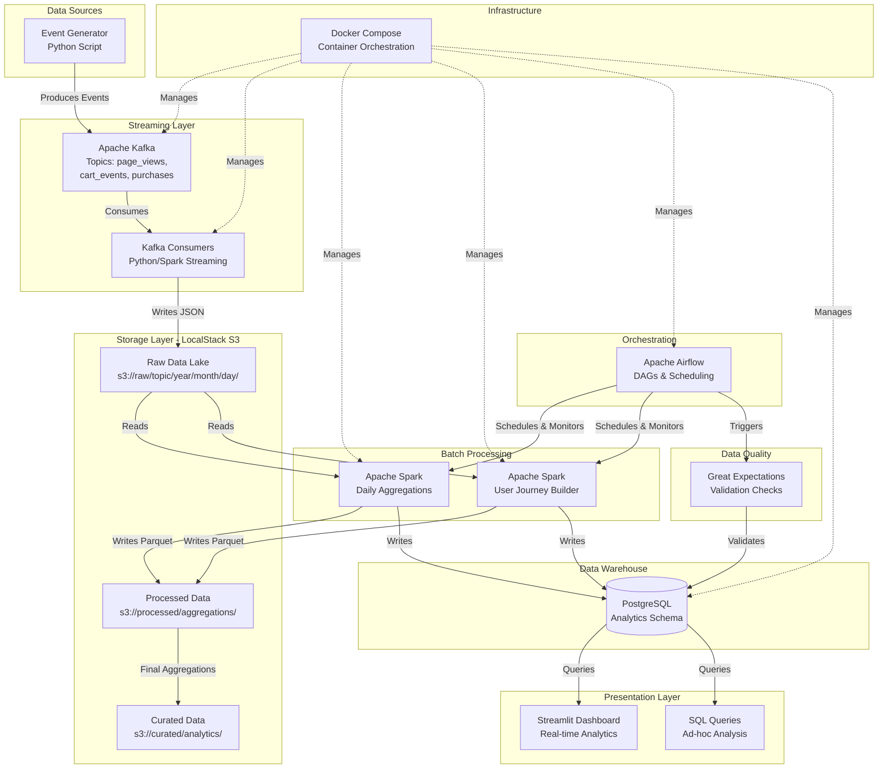

```mermaid
graph TB
    subgraph "Data Sources"
        A[Event Generator<br/>Python Script]
    end
    
    subgraph "Streaming Layer"
        B[Apache Kafka<br/>Topics: page_views,<br/>cart_events, purchases]
        C[Kafka Consumers<br/>Python/Spark Streaming]
    end
    
    subgraph "Storage Layer - LocalStack S3"
        D[Raw Data Lake<br/>s3://raw/topic/year/month/day/]
        E[Processed Data<br/>s3://processed/aggregations/]
        F[Curated Data<br/>s3://curated/analytics/]
    end
    
    subgraph "Batch Processing"
        G[Apache Spark<br/>Daily Aggregations]
        H[Apache Spark<br/>User Journey Builder]
    end
    
    subgraph "Orchestration"
        I[Apache Airflow<br/>DAGs & Scheduling]
    end
    
    subgraph "Data Warehouse"
        J[(PostgreSQL<br/>Analytics Schema)]
    end
    
    subgraph "Data Quality"
        K[Great Expectations<br/>Validation Checks]
    end
    
    subgraph "Presentation Layer"
        L[Streamlit Dashboard<br/>Real-time Analytics]
        M[SQL Queries<br/>Ad-hoc Analysis]
    end
    
    subgraph "Infrastructure"
        N[Docker Compose<br/>Container Orchestration]
    end
    
    A -->|Produces Events| B
    B -->|Consumes| C
    C -->|Writes JSON| D
    D -->|Reads| G
    D -->|Reads| H
    G -->|Writes Parquet| E
    H -->|Writes Parquet| E
    E -->|Final Aggregations| F
    G -->|Writes| J
    H -->|Writes| J
    I -->|Schedules & Monitors| G
    I -->|Schedules & Monitors| H
    I -->|Triggers| K
    K -->|Validates| J
    J -->|Queries| L
    J -->|Queries| M
    N -.->|Manages| B
    N -.->|Manages| C
    N -.->|Manages| G
    N -.->|Manages| H
    N -.->|Manages| I
    N -.->|Manages| J
```
